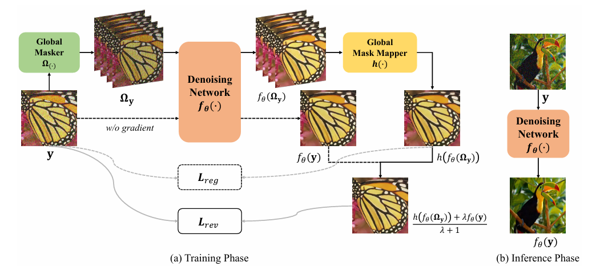
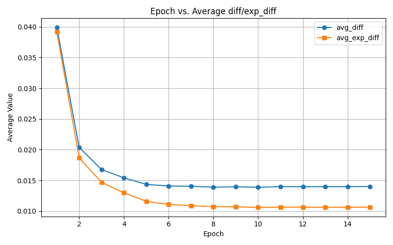
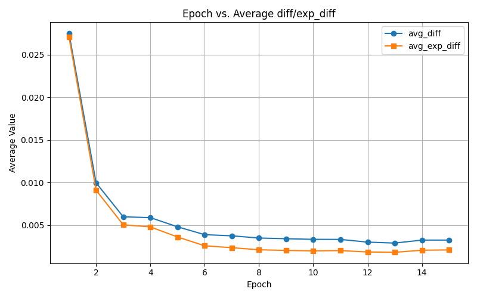

# Blind2Unblind with Jittor

<div align="center">

<div align="center">
  
</div>

</div>

This is an implementation of the paper [Blind2Unblind: Self-Supervised Image Denoising with Visible Blind Spots](https://arxiv.org/abs/2203.06967) with [Jittor](https://github.com/Jittor/jittor).


## ⚙️ Installation under Linux
You should firstly ensure Nvidia CUDA >= 10.0 and g++ >= 5.4.

Install jittor:
```bash
sudo apt install python3.8-dev libomp-dev
python3.8 -m pip install jittor
python3.8 -m jittor.test.test_example
```

Then you still need to install other libraries.
```bash
pip install -r requirements_jt.txt
```

We also have a pytorch version from the [official implementation](https://github.com/zejinwang/Blind2Unblind), directly execute:
```bash
pip install -r requirements.txt
```


## Command Arguments
* For train:
```
--noisetype: str, in 'gauss25', 'gauss5_50', 'poisson30', 'poisson5_50'
--train_dir: str, your dataset for training
--validation_dir: str, your dataset for validation
--resume: str, the filepath for optimizer etc. to resume states
--checkpoint: str, the model path you have trained for some epoches
--n_epoch: int, training epoches
--n_snapshot: int, the epoch gap for saving model checkpoint
```

* For test:
```
--noisetype: str, in 'gauss25', 'gauss5_50', 'poisson30', 'poisson5_50'
--checkpoint: str, the path for your pretrained model
--test_dirs: str, your dataset for test
```

## Prepare Dataset
* Download ImageNet Dataset for training (official implementation only use ImageNet Validation Dataset for training, ~50000 pngs):
```
cd dataset
aria2c -x 16 -s 16 'http://academictorrents.com/download/5d6d0df7ed81efd49ca99ea4737e0ae5e3a5f2e5.torren'
```
  Check dataset:
```
md5sum ILSVRC2012_img_val.tar ILSVRC2012_img_train.tar
29b22e2961454d5413ddabcf34fc5622 ILSVRC2012_img_val.tar
```
  Unzip dataset
```
mkdir train
tar -xvf ILSVRC2012_img_val.tar -C train
```

## 🚀 Quick Start

Train model with Jittor:

```bash
python train_jt.py --noisetype gauss25 --n_epoch 15 --n_snapshot 1
```

Test model with Jittor:

```bash
python test_jt.py --noisetype gauss25 --checkpoint pretrained/B2U_epochs15_jt.pkl
```

## Training loss


<div align="center">
  <div style="display: inline-block; margin: 10px;">
    
    <p style="text-align: center;">Jittor version</p>
  </div>
  <div style="display: inline-block; margin: 10px;">
    
    <p style="text-align: center;">pytorch version</p>
  </div>
</div>

## Performance Jittor vs Pytorch
* PSNR & SSIM


* Case Study


## 📝 Citation the official paper

```bibtex
@InProceedings{Wang_2022_CVPR,
    author    = {Wang, Zejin and Liu, Jiazheng and Li, Guoqing and Han, Hua},
    title     = {Blind2Unblind: Self-Supervised Image Denoising With Visible Blind Spots},
    booktitle = {Proceedings of the IEEE/CVF Conference on Computer Vision and Pattern Recognition (CVPR)},
    month     = {June},
    year      = {2022},
    pages     = {2027-2036}
}
```
